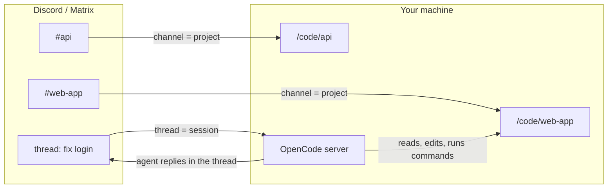
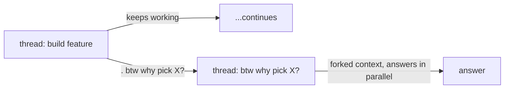
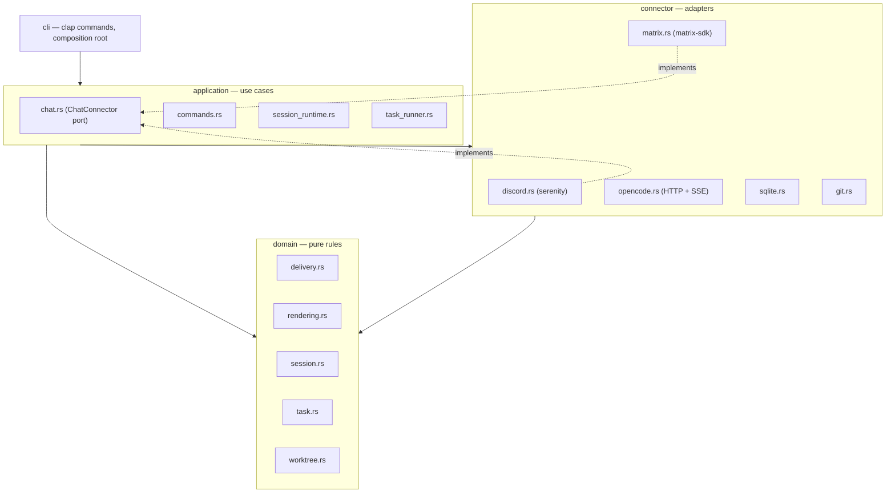

# lily

A collaborative agent orchestrator inside your chat, written in Rust. lily
connects Discord and Matrix to a local [OpenCode](https://opencode.ai) server
so you can drive coding agents from a conversation.

- **Channels are projects.** Each channel (or Matrix room) is linked to a
  project directory on the machine running lily.
- **Threads are sessions.** Every message you send in a project channel starts
  a thread bound to one OpenCode session. Messages in the thread continue it.



## Setup

1. Create a Discord bot at [discord.com/developers](https://discord.com/developers/applications),
   enable the **Message Content** intent, and invite it to your server with the
   `bot` and `applications.commands` scopes (send messages, create threads,
   manage threads).
2. Start an OpenCode server on the machine with your code: `opencode serve`
   (defaults to `127.0.0.1:4096`).
3. Run the bot:

```bash
export DISCORD_TOKEN=...      # bot token
cargo run --release -- run
```

4. In a Discord channel, run `/add-project directory:/code/web-app`
   (or from the CLI: `lily project add /code/web-app --channel <channel-id>`).
5. Send a message in the channel. lily creates a thread, starts a session in
   the project directory, and the agent replies in the thread (`⬥` for prose,
   `┣` for tool activity, a `-# lily ⋅ 2m 30s` footer per turn).

Configuration is environment-based: `DISCORD_TOKEN`, `OPENCODE_URL`
(default `http://127.0.0.1:4096`), `LILY_DATA_DIR` (default `~/.lily`),
`LILY_INTERRUPT_STEP_TIMEOUT_MS` (default `3000`), and `LILY_ALLOWED_USERS`
(comma-separated Discord ids and/or Matrix MXIDs; when set, everyone else is
ignored).

**Authorization:** the bot runs agents on the host machine, so lock it down.
Sensitive commands (`/add-project`, `/worktree`, `/delete-task`) default to
members with **Manage Guild**; adjust per command in Server Settings →
Integrations. For private setups, set `LILY_ALLOWED_USERS` to your own user id
so no one else can start sessions at all.

### Matrix

lily also speaks Matrix — rooms are projects, Matrix threads are sessions.
Set `MATRIX_HOMESERVER`, `MATRIX_USER`, and `MATRIX_PASSWORD` and run
`lily run`; Discord and Matrix can run side by side in one process (set both
sets of variables). The login session persists in `~/.lily/matrix-session.json`
and the bot auto-joins rooms it is invited to.

Matrix has no slash commands, so commands are text: `!add-project <dir>`,
`!queue <msg>`, `!clear [n]`, `!btw <prompt>`, `!worktree [name] [base]`,
`!list-worktrees`, `!tasks`, `!delete-task <id>`, `!help`. The `. queue` /
`. btw` suffixes, queued-message editing (`m.replace`), and agent output as
`m.notice` all work the same as on Discord. For scheduled tasks,
`lily send --channel '!room:server'` targets a room.

## Message handling

A normal message sent while the agent is mid-run acts as an **interrupt**: if
the current step is still going after ~3 seconds, lily aborts it and delivers
your message, so a new instruction takes over instead of waiting behind a
long-running command.


## The queue

Line up a message to send **when the current run finishes** instead of
interrupting it:

- `/queue <message>`, or end any message with a punctuation mark plus `queue`
  (`fix the test. queue`, `commit it! queue`, or `queue` on its own final line).
  The suffix is stripped before the prompt reaches the agent.
- If the session is busy you get the queue position; if it is idle the message
  dispatches immediately.
- **Edit the queued message** to update the queued prompt in place; remove the
  `queue` suffix and the item is dropped from the queue.
- When a queued message finally dispatches after waiting, it is shown as
  `» user: <prompt>`.
- `/clear [position]` clears everything or one entry.

## btw (side questions)

Ask a clarifying question in parallel without disturbing the running task:
`/btw <prompt>`, or end a message with punctuation plus `btw`
(`why this approach? btw`). lily forks the session's **full context** into a
new `btw: <prompt>` thread and dispatches the question there immediately. The
original thread is never paused. Unlike `queue`, the `btw` suffix requires
punctuation or a newline before it.



## Worktrees

Move a session into an isolated git worktree so it never touches your main
checkout:

- `/worktree [name] [base-branch]` — from a thread, the name is derived from
  the thread title (long names are compressed by stripping vowels:
  `configurable-sidebar-width` → `cnfgrbl-sdbr-wdth`); from a channel, pass a
  name and lily creates the thread immediately. The branch is `lily/<name>`,
  the worktree lives under `~/.lily/worktrees/`, the thread gets a
  `⬦ worktree:` prefix, and the existing session context is forked into the
  worktree. Merge the branch back whenever you like with your normal git
  workflow (or ask the agent to do it).
- `/list-worktrees` — list the project's worktrees (lily-created or not).

## Scheduled tasks

Run a prompt once at a future UTC time or on a cron schedule. The task posts a
thread you can reply to, optionally starting an agent session:

```bash
# One-time (UTC ISO, must end in Z)
lily send --channel <channel-id> --prompt 'Review open PRs' \
  --send-at '2026-07-01T09:00:00Z'

# Recurring (cron, UTC): every Monday 9am
lily send --channel <channel-id> --prompt 'Run the test suite and summarize failures' \
  --send-at '0 9 * * 1'

# Reminder that does not start an AI session
lily send --channel <channel-id> --prompt 'Rotate the staging API key' \
  --send-at '2026-06-30T09:00:00Z' --notify-only

# Continue an existing thread on a schedule
lily send --thread <thread-id> --prompt 'Check the deploy status' --send-at '@hourly'
```

Manage tasks with `lily task list [--all]`, `lily task edit <id> [--prompt ...]
[--send-at ...]`, `lily task delete <id>`, or from chat with `/tasks` and
`/delete-task`. Without `--send-at`, `lily send` schedules the prompt to run on
the bot's next scheduler tick (~5s). The scheduler recovers tasks stranded in
`running` after a crash and reschedules cron tasks after each run.

## Commands

| Command | Description |
|---|---|
| `/add-project <directory>` | Link the current channel to a project directory |
| `/queue <message>` | Queue a message for after the current run |
| `/clear [position]` | Clear the queue, or one entry |
| `/btw <prompt>` | Fork context into a new thread for a side question |
| `/worktree [name] [base-branch]` | Move the session into an isolated worktree |
| `/list-worktrees` | List worktrees for the channel's project |
| `/tasks` | List scheduled tasks |
| `/delete-task <id>` | Delete a scheduled task |

On Matrix the same commands are text commands (`!queue`, `!worktree`, ...).

## Architecture

The crate is layered domain-driven-design style. Dependencies point inward:
`domain` depends on nothing, `application` orchestrates domain rules over
connectors, `cli` wires it all together. The application layer talks to the
chat platform only through the `ChatConnector` port (thread/message ids are
opaque strings), so supporting another platform means implementing one trait
in a new connector.



State lives in SQLite at `~/.lily/lily.db`. The message queue is in-memory
per thread; everything needed to resume across restarts (channel links, thread
session ids, worktrees, tasks) is persisted.

Out of scope by design: remote-access features (browser control, tunnels,
screen sharing) — lily is a chat bot, not a remote desktop.

## Development

```bash
cargo test     # unit tests + git worktree integration tests
cargo clippy
```
