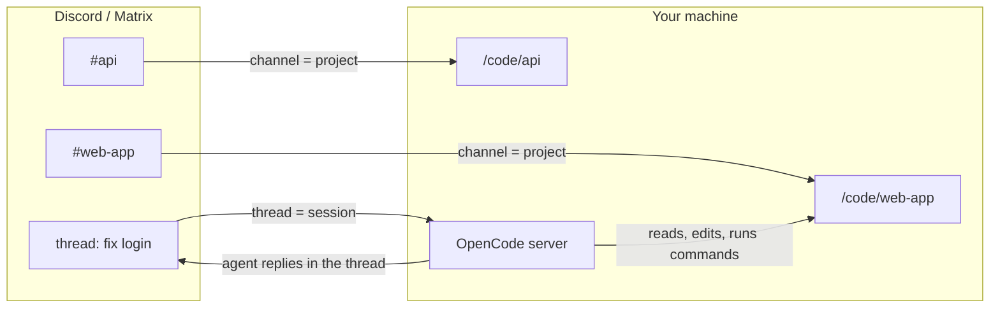
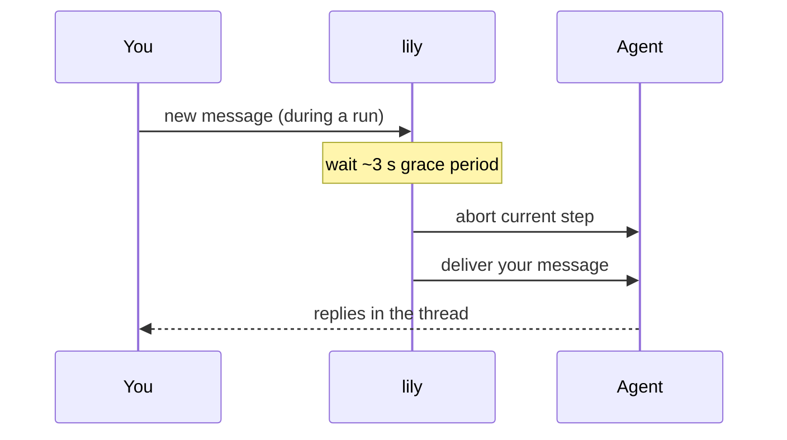
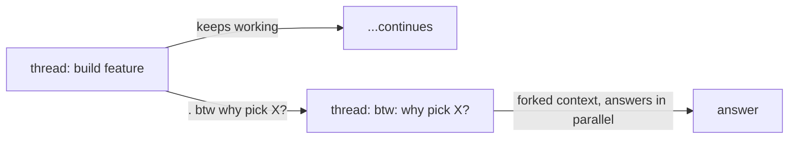
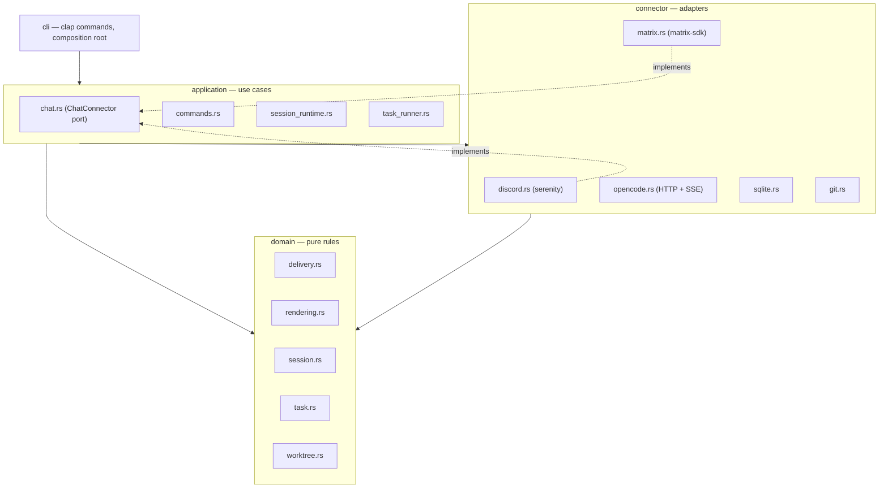

# lily

A collaborative agent orchestrator for your chat, written in Rust. lily connects
Discord and/or Matrix to a local [OpenCode](https://opencode.ai) server so you
can drive coding agents from a conversation.

- Each **channel** (Discord) or **room** (Matrix) is linked to a project directory on the machine running lily.
- Each **message** in a linked channel starts a **thread** bound to one OpenCode session. Messages in the thread continue it.



## Setup

### Prerequisites

lily requires a running OpenCode server on the same machine as your code:

```bash
opencode serve   # listens on 127.0.0.1:4096 by default
```

### Configuration

All configuration is via environment variables:

| Variable | Default | Description |
|---|---|---|
| `OPENCODE_URL` | `http://127.0.0.1:4096` | OpenCode server base URL |
| `LILY_DATA_DIR` | `~/.lily` | SQLite database and worktree storage root |
| `LILY_INTERRUPT_STEP_TIMEOUT_MS` | `3000` | Grace period (ms) before aborting a running step on a new message |
| `LILY_ALLOWED_USERS` | _(empty = everyone)_ | Comma-separated Discord snowflakes and/or Matrix MXIDs (`@user:server`). When set, all other users are ignored. |
| `DISCORD_TOKEN` | — | Discord bot token. Enables the Discord connector when set. |
| `MATRIX_HOMESERVER` | — | Matrix homeserver URL. Enables the Matrix connector when set. |
| `MATRIX_USER` | — | Matrix user id or localpart |
| `MATRIX_PASSWORD` | — | Matrix account password |

Both connectors can run simultaneously — set both sets of variables to serve Discord and Matrix from a single process.

> **Security note:** lily runs agents on the host machine. On Discord, the sensitive commands (`/add-project`, `/worktree`, `/delete-task`) require the **Manage Guild** permission by default; adjust per command in server settings. For private setups, set `LILY_ALLOWED_USERS` to your own user id so no one else can start sessions.

### Discord

1. Create a bot at [discord.com/developers](https://discord.com/developers/applications), enable the **Message Content** intent, and invite it to your server with the `bot` and `applications.commands` scopes (permissions needed: Send Messages, Create Public Threads, Manage Threads).
2. Set `DISCORD_TOKEN` and start lily:

```bash
export DISCORD_TOKEN=your-bot-token
cargo run --release -- run
```

3. In a channel, run `/add-project directory:/code/web-app` (or `lily project add /code/web-app --channel <channel-id>` from the CLI).
4. Send a message in the channel — lily creates a thread, starts a session in the linked directory, and the agent replies in the thread.

### Matrix

1. Set the Matrix env vars and start lily:

```bash
export MATRIX_HOMESERVER=https://matrix.example.org
export MATRIX_USER=lily
export MATRIX_PASSWORD=secret
cargo run --release -- run
```

2. Invite the bot account to a room. lily auto-joins on invite.
3. In the room, send `!add-project /code/web-app` to link it to a project directory.
4. Send a message in the room — lily starts a Matrix thread off that message and the agent replies there.

The login session persists to `~/.lily/matrix-session.json`; lily reuses it on restart without re-authenticating.

Matrix has no slash commands — all bot commands are plain text prefixed with `!` (see [Commands](#commands) below).

## Sessions and message handling

### Interrupts

A message sent while the agent is mid-run acts as an **interrupt**: lily waits ~3 seconds (configurable via `LILY_INTERRUPT_STEP_TIMEOUT_MS`) and then aborts the current step to deliver your message.



### Queue

Send a message **after** the current run finishes instead of interrupting it by appending `. queue` (or `! queue`, `\nqueue`) to your message, or by using the `/queue` command. The suffix is stripped before the prompt reaches the agent.

- If the session is busy, you get the queue position back.
- **Edit** the queued message to update the prompt in place; remove the `queue` suffix to drop it from the queue.
- When a queued message dispatches after waiting, it is shown as `» user: <prompt>`.
- `/clear [position]` clears all queued messages, or one by position.

### btw (side questions)

Ask a side question without pausing the running task. Append `. btw` (or `\nbtw`) to a message, or use `/btw <prompt>`. lily **forks the full session context** into a new `btw: <prompt>` thread and dispatches the question there immediately — the original thread is never paused.

Unlike `queue`, the `btw` suffix requires punctuation or a newline before it (`btw fix this` is not treated as btw).



## Worktrees

Move a session into an isolated git worktree so the agent never touches your main checkout:

- **`/worktree [name] [base-branch]`** — from a thread, the name is derived from the thread title (long names are compressed by stripping vowels: `configurable-sidebar-width` → `cnfgrbl-sdbr-wdth`); from a channel, a name is required. The branch is `lily/<name>`, the worktree lives under `~/.lily/worktrees/`, the thread is renamed with a `⬦ worktree:` prefix, and the existing session context is forked into the worktree.
- **`/list-worktrees`** — list all worktrees for the channel's project (lily-created and otherwise).

Merge the branch back whenever you like with your normal git workflow, or ask the agent to do it.

## Scheduled tasks

Schedule a prompt to run once at a future time or on a recurring cron schedule:

```bash
# One-time (UTC ISO, must end in Z)
lily send --channel <id> --prompt 'Review open PRs' --send-at '2026-07-01T09:00:00Z'

# Recurring (cron, UTC) — every weekday at 9 am
lily send --channel <id> --prompt 'Run the test suite and summarize failures' --send-at '0 9 * * 1-5'

# Notification only — no AI session started
lily send --channel <id> --prompt 'Rotate the staging API key' \
  --send-at '2026-06-30T09:00:00Z' --notify-only

# Continue an existing thread on a schedule
lily send --thread <id> --prompt 'Check the deploy status' --send-at '@hourly'
```

Manage tasks from the CLI (`lily task list`, `lily task edit <id>`, `lily task delete <id>`) or from chat (`/tasks`, `/delete-task <id>`). Without `--send-at`, `lily send` fires the prompt on the bot's next scheduler tick (~30 s). The scheduler recovers tasks stranded in `running` after a crash and reschedules recurring tasks after each run.

## Commands

| Discord | Matrix | Description |
|---|---|---|
| `/add-project <directory>` | `!add-project <dir>` | Link the current channel/room to a project directory |
| `/queue <message>` | `!queue <message>` | Queue a message for after the current run |
| `/clear [position]` | `!clear [n]` | Clear the queue, or one entry by position |
| `/btw <prompt>` | `!btw <prompt>` | Fork context into a new thread for a side question |
| `/worktree [name] [base-branch]` | `!worktree [name] [base]` | Move the session into an isolated git worktree |
| `/list-worktrees` | `!list-worktrees` | List worktrees for the channel's project |
| `/tasks` | `!tasks` | List scheduled tasks |
| `/delete-task <id>` | `!delete-task <id>` | Delete a scheduled task |
| _(message suffix)_ | _(message suffix)_ | End a message with `. queue` or `. btw` as an alternative to the slash/bang commands |

On Matrix, `!help` lists all available commands.

## Architecture

The crate is layered domain-driven-design style. Dependencies point inward: `domain` depends on nothing, `application` orchestrates domain rules over connectors, `cli` wires it all together. The application layer talks to chat platforms only through the `ChatConnector` trait (thread and message ids are opaque strings), so adding another platform means implementing one trait in a new connector.



State lives in SQLite at `~/.lily/lily.db`. The per-thread message queue is in-memory; everything needed to resume across restarts (channel links, thread session ids, worktrees, scheduled tasks) is persisted to the database.

## Development

```bash
cargo build
cargo test        # unit tests + git worktree integration tests
cargo clippy
```
